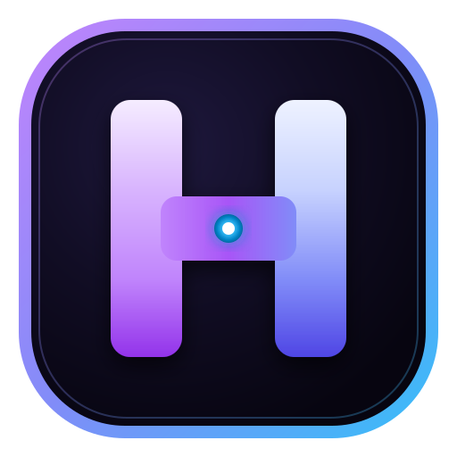
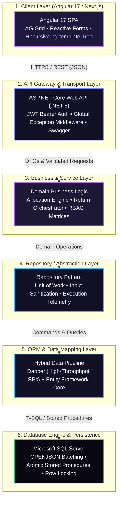

# 🚀 Hardik Jariwala — Full-Stack Portfolio

<div align="center">

  

  <h1>Hardik Jariwala</h1>
  <p><strong>Full-Stack .NET & Angular Software Engineer</strong></p>
  <p><em>Enterprise ERP Systems • High-Performance ASP.NET Core APIs • Angular (v7–v17) • SQL Server Optimization</em></p>

  <p>
    <a href="https://linkedin.com/in/hardik-jariwala-71b7a2275/"></a>
    <a href="mailto:hardikjariwala869@gmail.com"></a>
    <a href="#-projects-showcase"></a>
    <a href="#-getting-started"></a>
    <a href="#-getting-started"></a>
    <a href="#-getting-started"></a>
    <a href="#-getting-started"></a>
  </p>

</div>

---

## 📑 Table of Contents

1. [About The Project](#-about-the-project)
2. [About Hardik Jariwala](#-about-hardik-jariwala)
3. [Key Highlights & UI Features](#-key-highlights--ui-features)
4. [Flagship Enterprise Projects](#-flagship-enterprise-projects)
5. [In-Depth Engineering Case Studies](#-in-depth-engineering-case-studies)
6. [Enterprise 6-Tier Architecture Blueprint](#-enterprise-6-tier-architecture-blueprint)
7. [Technical Skills Matrix](#-technical-skills-matrix)
8. [Project Structure](#-project-structure)
9. [Tech Stack & Dependencies](#-tech-stack--dependencies)
10. [Getting Started (Local Setup)](#-getting-started-local-setup)
11. [Favicon & Branding Suite](#-favicon--branding-suite)
12. [Configuration & Customization Guide](#-configuration--customization-guide)
13. [Deployment Guide](#-deployment-guide)
14. [Contact & Professional Profiles](#-contact--professional-profiles)

---

## 🌟 About The Project

This repository contains the source code for the personal engineering portfolio of **Hardik Jariwala**. Built using **Next.js 16 (Turbopack)**, **React 19**, **TypeScript**, and **Tailwind CSS v4**, this web application delivers an immersive, high-performance developer showcase that mirrors the precision and architectural rigor of enterprise software.

### What Makes This Portfolio Unique?
- **Designed for Technical Scrutiny:** Far beyond a standard resume website, it details real-world database procedures, atomic transaction mechanisms, ERP workflows, and frontend state pipelines.
- **Glassmorphic Cyber Aesthetic:** Tailored deep violet/obsidian theme (`#090812`) with ambient neon borders, glowing gradients (`#c084fc`, `#818cf8`, `#38bdf8`), and zero clunky default components.
- **Interactive Canvas Physics:** Custom HTML5 Canvas nebula particles powered by math physics and smooth animations using AnimeJS.
- **Branded Capital "H" Favicon:** Custom-engineered SVG monogram, multi-resolution `.ico` (16x16, 32x32, 48x48), and Apple touch icons.

---

## 👨‍💻 About Hardik Jariwala

- **Current Role:** Software Development Engineer 1 (SDE-1) at **CodexLancers**
- **Career Path:** Progressed from **.NET Intern** (Jan 2024) to full **SDE-1**, earning end-to-end ownership of mission-critical features from UI through API to SQL Server business logic.
- **Experience:** 2+ Years Professional Experience in full-stack enterprise development.
- **Education:** **Master of Computer Applications (MCA)**, Graduated 2024 from Sarvajanik University, Surat, Gujarat, India.
- **Core Philosophy:** *Backend integrity first.* Clean architecture, atomic database transactions, zero balance discrepancies, and defensive null handling—paired with reactive, component-driven Angular user interfaces.

---

## ✨ Key Highlights & UI Features

| Component | Functionality & Design Detail |
|---|---|
| **🛸 Navbar** | Glassmorphic sticky header with scroll detection, active section spy, mobile drawer, resume download trigger, and theme toggle. |
| **🌌 Hero Section** | High-impact headline, dynamic status badge (*"Available for Full-Stack Opportunities"*), quick action CTAs, and interactive background particle nebula. |
| **👤 About Section** | Detailed professional narrative, core competencies, career milestones, and key metrics. |
| **⚡ Skills Matrix** | Tabbed category filter (Backend, Frontend, Database, DevOps, Other) with proficiency score meters and experience tier badges. |
| **📈 Experience Timeline** | Vertical timeline detailing responsibilities and milestones at CodexLancers, including production debugging and deployment support. |
| **💼 Projects Showcase** | Card grid highlighting DIZ Ride Hailing, LinkERP, Time Tracking Tool, ProRanked EV, and SutraPlus with live tags and metrics. |
| **🔬 Case Studies** | Deep technical breakdowns of complex challenges: *ERP Transaction Allocation & Product Returns*, *Recursive Document Management System (DMS)*, and *Angular 7 → 17 & .NET 6 → 8 Migration*. |
| **🏛️ Architecture Blueprint** | Interactive layered representation of the 6-Tier Enterprise Clean Architecture stack. |
| **🎓 Education & Goals** | MCA graduation details and roadmap toward distributed cloud architectures, Docker, Redis, and AI/ML backend integrations. |
| **📬 Contact Section** | Direct interactive contact channels, verified email, phone, location, and downloadable PDF resume. |
| **🌓 Theme Switcher** | Instant toggle between Deep Cyber Dark and Crisp Modern Light modes with persistent `localStorage` support. |
| **🎯 Custom Magnetic Cursor** | Responsive trailing cursor effect that smoothly interacts with buttons and cards. |

---

## 🚀 Flagship Enterprise Projects

### 1. 🚖 DIZ Ride Hailing Platform *(Primary Flagship Project)*
- **Category:** On-Demand Ride Dispatch & Fleet Telemetry
- **Stack:** Angular, TypeScript, Firebase Authentication, Firebase Realtime Database, RxJS, Reactive Forms, REST APIs
- **Overview:** An on-demand ride-hailing and fleet coordination platform engineered to deliver dynamic pick-up and drop-off transport services with real-time tracking.
- **Key Engineering Highlights:**
  - Engineered reactive client booking flows with real-time pickup and drop-off location handling.
  - Integrated Firebase Authentication and Realtime Database for live telemetry, trip status synchronization, and instant driver dispatch.
  - Architected resilient client-side state pipelines using RxJS observables for live trip updates without page reloads.

---

### 2. ⏱️ Time Tracking & Shift Management Tool
- **Category:** Enterprise Workforce Operations & Mobile Alerts
- **Stack:** ASP.NET Core, C#, Angular, Firebase Cloud Messaging (FCM), SQL Server, Entity Framework, REST APIs
- **Overview:** Operational workforce tool dedicated to employee shift scheduling, real-time hours tracking, and supervisor review workflows.
- **Key Engineering Highlights:**
  - Built employee shift management modules: shift scheduling, real-time tracking logs, and supervisor approval state machines.
  - Integrated **Firebase Cloud Messaging (FCM)** to trigger instant web-to-mobile push notifications for shift start/end alerts and supervisor notices.
  - Implemented ASP.NET Core REST APIs and SQL Server tables handling audit trails and shift transition validations.

---

### 3. ⚡ ProRanked — EV Station Admin Portal
- **Category:** EV Charging Station Management & Microservices
- **Stack:** Angular, TypeScript, ASP.NET Core, .NET Web API Microservices, C#, SQL Server, REST APIs
- **Overview:** Centralized administrative portal for monitoring, operating, and managing Electric Vehicle (EV) charging stations across multiple geographic hubs.
- **Key Engineering Highlights:**
  - Built an administrative Angular portal for real-time station monitoring, operational state toggles, and live charger status.
  - Architected high-throughput ASP.NET Core microservices to ingest charger telemetry, status beacons, and user transaction records.
  - Designed clean service boundaries ensuring high availability and fault-tolerant communication between station hardware and admin dashboards.

---

### 4. 🏢 LinkERP / LinkERP-V2
- **Category:** Multi-Module Enterprise ERP / Business Management Platform
- **Stack:** ASP.NET Core (.NET 8), C#, Angular 17, SQL Server, Stored Procedures, T-SQL Transactions, `OPENJSON`, AG Grid, Dapper, Entity Framework Core, IIS
- **Overview:** Large-scale enterprise ERP managing end-to-end commercial operations. Hardik developed mission-critical features across UI, API, business logic, and database tiers.
- **Key Modules Owned & Delivered:**
  - **Debit/Credit Amount Allocation (`AR_CreditDebitAllocationManagement`):** Real-time matching of receipts and credit notes against debit invoices with partial allocations and zero balance mismatch.
  - **Customer Product Returns & Debtor Refunds (`AR_DebtorRefundManagement`):** End-to-end coordination of warehouse restock, credit note generation, tax/COGS reversals, and invoice balance adjustments in atomic transactions.
  - **Document Management System (DMS):** Custom recursive tree view (`*ngTemplateOutlet`), 3-tier RBAC (`SecurityAccessEnum`), and AG Grid file explorer.
  - **Inventory & Multi-Bin Stock Tracking:** Warehouse bin allocations, batch tracking, and inventory transfers.
  - **Purchasing & Multi-Tier Approvals (PR/PO):** Configurable approval state machines.
  - **Sales Order Processing (SOP) & Credit Sales:** Customer credit ceiling validation and dispatch workflows.

---

### 5. 🖥️ SutraPlus
- **Category:** Enterprise Desktop Application
- **Stack:** C#, WPF (Windows Presentation Foundation), XAML, ADO.NET, SQL Server, T-SQL
- **Overview:** High-performance desktop software delivering localized inventory tracking, invoice generation, and low-latency direct database interaction via ADO.NET pipelines.

---

## 🔬 In-Depth Engineering Case Studies

### 🔹 Case Study 1: ERP Transaction Allocation & Customer Product Returns
- **The Challenge:** In enterprise accounting, allocating receipts and credit notes across multiple invoices requires handling partial splits, remaining balance tracking, and ledger reconciliation. When a customer returns goods, the system must atomically reverse stock into specific warehouse bins, issue debtor credit notes, recalculate taxes/COGS, and reallocate previous transaction balances—without race conditions or rounding discrepancies.
- **The Solution:**
  - Designed an interactive AG Grid interface in Angular 17 with live balance verification.
  - Authored atomic SQL Server stored procedures (`AR_CreditDebitAllocationManagement`, `AR_DebitCreditAllocationManagement`, `AR_DebtorRefundManagement`) utilizing `OPENJSON` to parse array payloads in single database round-trips.
  - Implemented strict `TRY...CATCH` blocks with row-level locking hints (`UPDLOCK`, `ROWLOCK`) preventing duplicate allocations during concurrent multi-user submissions.
- **The Outcome:** 100% financial ledger consistency, elimination of race condition discrepancies, and automated inventory replenishment.

---

### 🔹 Case Study 2: Document Management System (DMS) & RBAC Security
- **The Challenge:** Enterprise ERP documentation required unlimited folder/subfolder nesting and strict user/role authorization. Standard third-party Angular tree libraries introduced excessive bundle bloat and lacked smooth drag-and-drop or inline renaming support. Moreover, client-side hiding alone posed major security risks against direct API calls.
- **The Solution:**
  - Built a zero-dependency recursive tree component using native Angular `<ng-template #recursiveFolderTemplate>` and `*ngTemplateOutlet`.
  - Implemented HTML5 drag-and-drop re-parenting, inline debounce editing, and breadcrumb navigation.
  - Enforced a 3-tier security matrix (`SecurityAccessEnum`: Admin, Editor, Viewer) validated at both the Angular button level and the C# API interceptor / SQL stored procedure layer.
- **The Outcome:** Blazing-fast tree rendering with zero third-party bloat, complete access isolation, and seamless AG Grid file exploration.

---

### 🔹 Case Study 3: Enterprise Stack Migration (.NET 6 → 8 & Angular 7 → 17)
- **The Challenge:** Modernizing a legacy enterprise codebase to unlock modern performance, updated security standards, and enhanced developer ergonomics.
- **The Solution:**
  - Migrated legacy Angular 7 modules to modern standalone patterns and updated RxJS pipeline operators.
  - Upgraded AG Grid enterprise packages and adjusted Angular Material theming tokens.
  - Refactored ASP.NET Core startup to .NET 8 minimal hosting conventions, updated NuGet packages, and re-verified IIS URL Rewrite / CORS compatibility.
- **The Outcome:** Significantly reduced build times, enhanced client runtime performance, and a future-proof code architecture.

---

## 🏛️ Enterprise 6-Tier Architecture Blueprint



1. **Angular 17 UI Layer:** Reactive components, AG Grid financial grids, RxJS state streams, recursive template trees.
2. **ASP.NET Core Web API:** Request pipeline, JWT claims verification, FluentValidation, centralized error handling.
3. **Business Logic Layer:** Multi-tier approval matrices, balance calculations, return orchestration, and RBAC evaluations.
4. **Repository Layer:** Encapsulates data persistence rules and isolates domain logic from storage implementation.
5. **Dapper & EF Core Layer:** Fast micro-ORM execution for high-volume stored procedures alongside EF Core modeling.
6. **SQL Server Database Engine:** Normalized relational schema, non-clustered indexes, atomic transactions, and `OPENJSON` batch processing.

---

## 📊 Technical Skills Matrix

### ⚙️ Backend Engineering
| Technology | Proficiency | Experience Level | Description / Real-World Application |
|---|:---:|:---:|---|
| **C#** | 92% | Strong / Hands-on | Primary language for ASP.NET Core, Linq, async/await, and enterprise backend pipelines. |
| **ASP.NET Core (.NET 6 / 8)** | 90% | Strong / Hands-on | RESTful Web APIs, middleware, JWT authentication, dependency injection. |
| **ASP.NET Web API** | 92% | Strong / Hands-on | High-throughput endpoints, DTO validation, and API documentation. |
| **Dapper** | 88% | Strong / Hands-on | High-performance micro-ORM queries and stored procedure parameter binding. |
| **Entity Framework Core** | 86% | Strong / Hands-on | Relational mapping, migrations, and DbContext management. |
| **ADO.NET** | 84% | Strong / Hands-on | Low-latency database interactions for WPF desktop applications (SutraPlus). |
| **JWT Auth & Authorization** | 88% | Strong / Hands-on | Secure role-based tokens, claims validation, and permission authorization filters. |
| **Microservices** | 88% | Strong / Hands-on | Modular service architecture engineered for EV station telemetry and admin APIs. |

### 🎨 Frontend Engineering
| Technology | Proficiency | Experience Level | Description / Real-World Application |
|---|:---:|:---:|---|
| **Angular (v7 → v17)** | 90% | Strong / Hands-on | Modern standalone components, routing, dependency injection, and state pipelines. |
| **TypeScript** | 88% | Strong / Hands-on | Strict type-safety, interface modeling, generics, and reactive data patterns. |
| **AG Grid** | 88% | Strong / Hands-on | High-density ERP financial tables, live cell edits, custom renderers, and filtering. |
| **Reactive Forms & RxJS** | 90% | Strong / Hands-on | Dynamic validation, quantity caps, observable streams, and asynchronous debounce. |
| **Angular Material** | 86% | Strong / Hands-on | Enterprise UI component library integration, dialogs, and styled themes. |
| **Tailwind CSS & CSS3** | 90% | Strong / Hands-on | Responsive grid systems, modern glassmorphic styling, and fluid animations. |

### 🗄️ Database & Persistence
| Technology | Proficiency | Experience Level | Description / Real-World Application |
|---|:---:|:---:|---|
| **SQL Server** | 94% | Strong / Hands-on | Mission-critical database engine holding complex enterprise ERP schemas. |
| **Stored Procedures** | 95% | Strong / Hands-on | High-performance batch logic (`OPENJSON`), audit logs, and complex calculations. |
| **T-SQL & Transactions** | 92% | Strong / Hands-on | ACID transactions, explicit row-level locking (`UPDLOCK`), and error handling (`TRY...CATCH`). |
| **Query Optimization** | 88% | Strong / Hands-on | Execution plan analysis, non-clustered indexing, and bottleneck elimination. |
| **Database Debugging** | 90% | Strong / Hands-on | Profiling slow queries, deadlocks, lock escalation, and schema constraints. |

### 🚀 DevOps, Cloud & Tools
| Technology | Experience Level | Description / Real-World Application |
|---|:---:|---|
| **IIS (Internet Information Services)** | Working Knowledge | Hosting ASP.NET Core APIs, URL Rewrite, Application Request Routing (ARR), and CORS. |
| **Firebase (Auth, DB, FCM)** | Strong / Hands-on | Real-time ride telemetry (DIZ) and web-to-mobile push notifications (Time Tracker). |
| **PM2 Process Manager** | Working Knowledge | Background service supervision and zero-downtime reloads. |
| **Git & GitLab** | Working Knowledge | Feature branching, code reviews, Merge Requests, and version control. |
| **Swagger / OpenAPI** | Working Knowledge | Comprehensive API schema documentation and interactive testing. |
| **Docker** | Familiar With | Containerization of microservices and local development environments. |
| **Redis / Memurai** | Familiar With | In-memory distributed caching and session management. |

---

## 📁 Project Structure

```bash
hardik-portfolio/
├── public/                         # Static files & assets
│   ├── favicon.svg                 # Vector Capital 'H' SVG Favicon
│   ├── favicon.ico                 # Multi-size ICO (16x16, 32x32, 48x48)
│   ├── apple-touch-icon.png        # 180x180 Apple Touch Icon
│   ├── Hardik-CV.pdf               # Downloadable PDF Resume
│   ├── next.svg / vercel.svg       # Framework badges
│   └── globe.svg / window.svg      # UI vector icons
├── src/
│   ├── app/                        # Next.js App Router root
│   │   ├── favicon.ico             # App router favicon
│   │   ├── icon.svg                # Dynamic SVG favicon
│   │   ├── icon.png                # 512x512 PNG favicon
│   │   ├── apple-icon.png          # App router Apple icon
│   │   ├── globals.css             # Design tokens & Tailwind CSS v4 directives
│   │   ├── layout.tsx              # Root HTML layout, SEO, fonts, & metadata
│   │   └── page.tsx                # Main single-page portfolio layout
│   ├── components/                 # Reusable React components
│   │   ├── Navbar.tsx              # Sticky glassmorphic navbar with active spy
│   │   ├── Hero.tsx                # Hero section with introduction & action buttons
│   │   ├── HeroNebulaBackground.tsx# Interactive HTML5 Canvas particle nebula
│   │   ├── AnimatedBackground.tsx  # Secondary subtle mesh animation
│   │   ├── About.tsx               # Biography, philosophy, and milestones
│   │   ├── Skills.tsx              # Interactive filterable skills matrix
│   │   ├── Experience.tsx          # Career timeline at CodexLancers (.NET Intern → SDE-1)
│   │   ├── Projects.tsx            # Flagship projects showcase cards
│   │   ├── CaseStudies.tsx         # Deep-dive enterprise engineering case studies
│   │   ├── Architecture.tsx        # 6-Tier Clean Architecture diagram
│   │   ├── EducationGoals.tsx      # MCA education details & future roadmap
│   │   ├── Contact.tsx             # Interactive contact channels & CV trigger
│   │   ├── Footer.tsx              # Footer with copyright and quick links
│   │   ├── CustomCursor.tsx        # Trailing magnetic cursor
│   │   └── ThemeToggle.tsx         # Dark / Light theme switch button
│   ├── context/
│   │   └── ThemeContext.tsx        # React Context provider for theme persistence
│   ├── data/
│   │   └── portfolioData.ts        # Centralized data repository (single source of truth)
│   ├── hooks/                      # Custom hooks (e.g., useActiveSection, useScroll)
│   └── types/
│       └── index.ts                # TypeScript interfaces for all data structures
├── scripts/
│   └── generate-favicons.js        # Node + Sharp automated favicon generation script
├── eslint.config.mjs               # ESLint configuration
├── next.config.ts                  # Next.js compiler and build configuration
├── package.json                    # Project dependencies and npm scripts
├── postcss.config.mjs              # PostCSS configuration for Tailwind
├── tsconfig.json                   # TypeScript compiler options
└── README.md                       # Complete project documentation
```

---

## 💻 Tech Stack & Dependencies

| Dependency | Version | Role in Project |
|---|---|---|
| **next** | `16.3.3` | React Framework with App Router & Turbopack |
| **react** | `19.2.8` | UI Component rendering engine |
| **react-dom** | `19.2.8` | DOM rendering adapter |
| **typescript** | `^5` | Strict static typing and type safety |
| **tailwindcss** | `^4` | Utility-first styling engine with CSS variables |
| **@tailwindcss/postcss**| `^4` | PostCSS plugin for Tailwind CSS v4 |
| **lucide-react** | `^1.38.0` | Modern, clean vector icon suite |
| **animejs** | `^3.2.2` | High-performance JavaScript animation engine |
| **clsx** / **tailwind-merge** | Latest | Safe, dynamic Tailwind className composition |
| **sharp** | `^0.35.4` | High-speed image processing for favicon generation |

---

## 🚀 Getting Started (Local Setup)

### 1. Prerequisites
Ensure you have the following installed on your local machine:
- **Node.js:** `v18.17.0` or higher (tested on Node `v20` and `v24`)
- **npm:** `v9+` or `pnpm` / `yarn`

### 2. Clone the Repository
```bash
git clone https://github.com/hardikjari/hardik-portfolio.git
cd hardik-portfolio
```

### 3. Install Dependencies
```bash
npm install
```

### 4. Run Development Server
Start the local Next.js dev server with Turbopack:
```bash
npm run dev
```
Open [http://localhost:3000](http://localhost:3000) in your web browser to explore the portfolio.

### 5. Build for Production
To test the optimized production build:
```bash
npm run build
npm run start
```

### 6. Linting
Run ESLint to check for code standards and lint issues:
```bash
npm run lint
```

---

## 🔤 Favicon & Branding Suite

The project includes an automated script using `sharp` to render custom, high-resolution vector and raster favicons featuring Hardik's **Capital "H"** monogram:

- `src/app/icon.svg` & `public/favicon.svg`: Vector SVG with dark violet squircle, glowing ambient stroke, and radiant 3D "H".
- `src/app/favicon.ico` & `public/favicon.ico`: Multi-resolution Windows/browser icon containing `16x16`, `32x32`, and `48x48` PNG frames.
- `src/app/apple-icon.png` & `public/apple-touch-icon.png`: Crisp `180x180` high-DPI icon for Apple mobile bookmarks.
- `src/app/icon.png`: `512x512` high-resolution PWA/web app icon.

To regenerate or customize the favicons, run:
```bash
node scripts/generate-favicons.js
```

---

## ⚙️ Configuration & Customization Guide

### 📝 1. Updating Content (Single Source of Truth)
All text, contact information, projects, case studies, and skills are stored in a single decoupled configuration file:
👉 [src/data/portfolioData.ts](file:///d:/Clones/hardik-portfolio/src/data/portfolioData.ts)

To add a new project or update details:
```typescript
// src/data/portfolioData.ts
export const PROJECTS: ProjectItem[] = [
  // Add your new project object here
  {
    id: "new-project",
    title: "Project Name",
    subtitle: "Brief Subtitle",
    isFlagship: false,
    category: "Web Application",
    summary: "Short summary...",
    description: "Detailed description...",
    technologies: ["C#", "ASP.NET Core", "Angular"],
    highlights: ["Highlight 1", "Highlight 2"],
  },
  ...
];
```

### 📄 2. Replacing the Resume PDF
Place your updated resume file in the `public/` folder named `Hardik-CV.pdf`. The download links in the Navbar and Hero sections automatically link to `/Hardik-CV.pdf`.

### 🎨 3. Adjusting Theme Colors & Tokens
Design tokens are centralized in [src/app/globals.css](file:///d:/Clones/hardik-portfolio/src/app/globals.css). You can adjust CSS variables:
```css
:root, .dark {
  --bg-base: #090812;          /* Main page background */
  --bg-surface: #121024;       /* Card background */
  --accent-purple: #c084fc;    /* Primary brand accent */
  --accent-blue: #818cf8;      /* Secondary accent */
  --accent-cyan: #38bdf8;      /* Highlight accent */
}
```

---

## 🌐 Deployment Guide

### Deploying to Vercel (Recommended)
1. Push your repository to GitHub or GitLab.
2. Sign in to [Vercel](https://vercel.com) and click **"Add New Project"**.
3. Select `hardik-portfolio` from your git repositories.
4. Framework preset **Next.js** will be detected automatically.
5. Click **"Deploy"**.

### Deploying to Windows Server / IIS (Enterprise Hosting)
1. Run `npm run build` on your deployment machine.
2. Configure **IIS URL Rewrite** and **Application Request Routing (ARR)** to reverse proxy incoming requests on port 80/443 to the Node.js process running on `http://localhost:3000`.
3. Use **PM2** to manage the background process:
   ```bash
   npm install -g pm2
   pm2 start npm --name "hardik-portfolio" -- start
   pm2 save
   ```

---

## 📬 Contact & Professional Profiles

Feel free to reach out for collaborations, full-stack .NET & Angular engineering roles, or technical discussions!

- **👤 Name:** Hardik Jariwala
- **💼 Current Role:** SDE-1 at CodexLancers
- **📍 Location:** Surat, Gujarat, India
- **📧 Email:** [hardikjariwala869@gmail.com](mailto:hardikjariwala869@gmail.com)
- **🔗 LinkedIn:** [linkedin.com/in/hardik-jariwala-71b7a2275](https://www.linkedin.com/in/hardik-jariwala-71b7a2275/)
- **📱 Phone:** [+91 7016185309](tel:+917016185309)

---

<div align="center">
  <p>Crafted with precision by <strong>Hardik Jariwala</strong> • Built with Next.js, React, and TypeScript.</p>
  <p><em>© 2026 Hardik Jariwala. All rights reserved.</em></p>
</div>